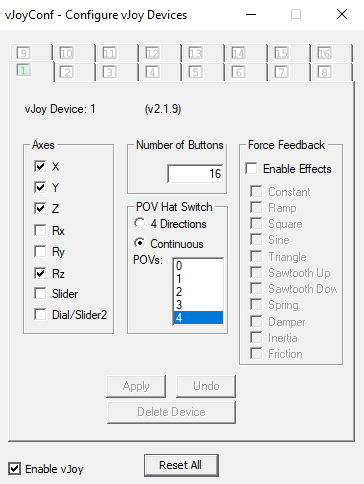

# Android Gamepad To PC
This project emulates any gamepad connected to your Android as a desktop gamepad.

**Why would you need this?**

1- Wired controllers are cheap, now you can make them become wireless!

2- PC's USB port are either all used or destroyed, Android Gamepad to PC is here for the rescue.

3- The wireless range is as huge as your routers range, obstacles are not that critical now!

4- Got a Bluetooth wireless controller but your PC doesn't support Bluetooth, No problem!

**Steps**

**Downloads, Configurations & Installations**

1- Download vJoy and install its drivers from https://sourceforge.net/projects/vjoystick/files/latest/download. Later versions might have issues.

2- Search and open "Configure vJoy" from the Start menu.

3- Make sure the check box "Enable vJoy" is enabled and the settings as following:

4- Download and extract https://github.com/MohamedMassoud/Android-Gamepad-To-PC/archive/refs/tags/serverApp.zip. The extracted folder is the server application.

5- Install Android Gamepad To PC application on your Android device from the Play store: https://play.google.com/store/apps/details?id=com.MohamedMassoud.Atom.

**How to run it**

1- Make sure your Android device and your PC are connected to the same network or router.

2- Run the server application on your computer but opening Android Gamepad To PC v1.0.exe from the extracted server folder.

3- If you've installed vJoy correctly, the server application will notify you that vJoy is detected and is awaiting connection from you Android device as following:

4- Connect your gamepad to you android phone either through bluetooth or USB OTG.

5- Type in your PC's IP address that appears on the PC's application into your Android application and press Connect.

6- Once you press Connect, the server application should notify you that connection is successful as following:

7- Enjoy the wireless experience.

**Android application**

**Server application**

**Tips**

1- Your screen has to be on so that your gameplay doesn't get interrupted by the Android System. Pressing any button on the gamepad does trigger the screen to be on however, you might need to adjust your device's screen sleep timeout in case you stay idle.

2- Your screen being on during your gameplay might drain your battery, so please lower down your screen's brightness to save battery.

3- If you ever minimized your server application and want to re-open or exit, you can right click on the application's tray for options as following:

**Extras**

1- You can convert vJoy device into XBOX windows controller using XOutput, for more info visit: https://github.com/csutorasa/XOutput.

2- You can disable vJoy controller if you are using XOutput alongside vJoy to avoid conflict in some games using HiDGuardian. HiDGuardian Blocks various input devices from being accessed by user-mode applications. for more visit: https://github.com/ViGEm/HidGuardian.

**Credits**

1- Many thanks to vJoy for implementing the drivers. vJoy's GitHub: https://github.com/shauleiz/vJoy.

2- Many thanks to rlj1202 for creating the Java library (JvJoyInterface) for vJoy to write vJoy feeder. JvJoyInterface's GitHub: https://github.com/rlj1202/JvJoyInterface.
